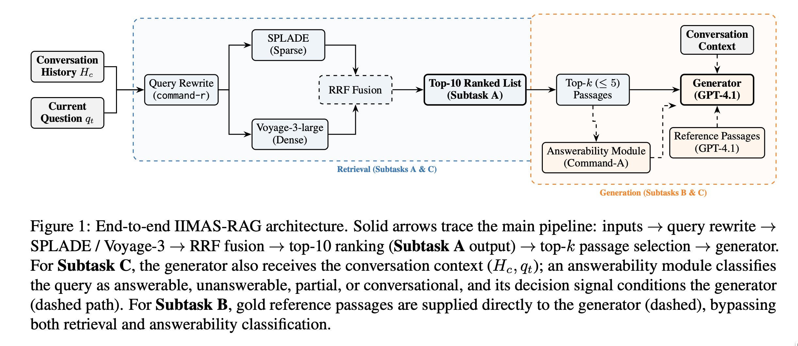
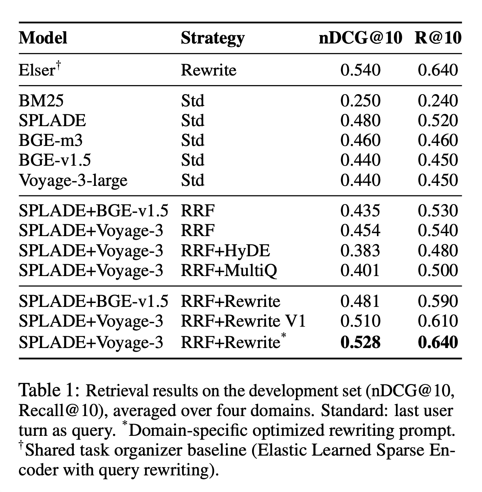
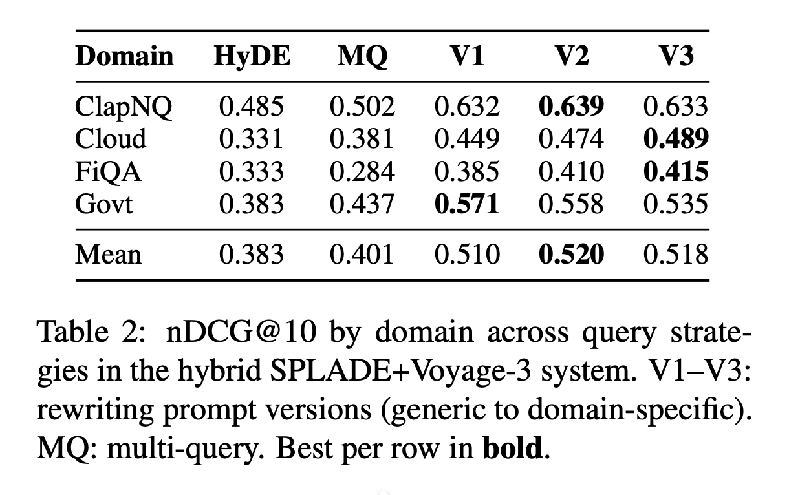
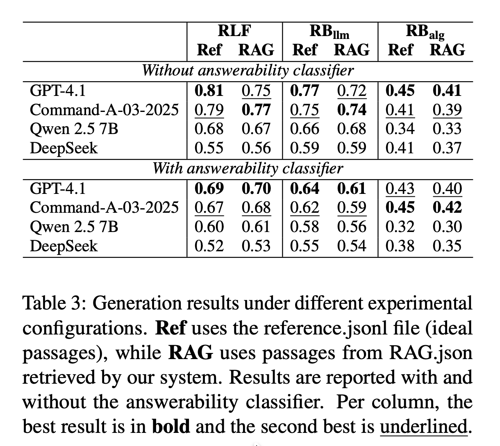
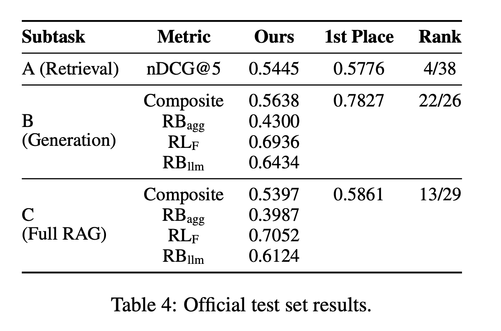

# IIMAS-RAG @ SemEval 2026 — Multi-Turn RAG

**Team:** IIMAS-RAG · Instituto de Investigaciones en Matemáticas Aplicadas y en Sistemas, UNAM  
**Competition:** [SemEval 2026](https://semeval.github.io/SemEval2026/) — Multi-Turn Retrieval-Augmented Generation (MT-RAG)

---

## Overview

This repository contains the code, configurations, and resources for our system submitted to **SemEval 2026 MT-RAG**, covering all three tasks of the shared task. Our approach builds a full conversational RAG pipeline — from passage retrieval to answerability classification and response generation — evaluated on four specialized domains: **CLAPNQ**, **Cloud**, **FiQA**, and **Govt**.

<p align="center">
  
</p>

---

## Repository Structure

| Folder | Task | Description |
|--------|------|-------------|
| [`TASK A/`](TASK%20A/) | Retrieval | Hybrid sparse-dense retrieval pipeline (SPLADE + Voyage/BGE, RRF fusion) |
| [`TASK B/`](TASK%20B/) | Answerability | Answer generation and answerability labeling (GPT-4 / Cohere Command-R) |
| [`TASK C/`](TASK%20C/) | Full RAG | End-to-end RAG pipeline combining retrieval + generation |

---

## Task A — Passage Retrieval

We combined **SPLADE-v3** (sparse) and **Voyage-3-large** (dense) retrievers using **Reciprocal Rank Fusion** (RRF, k=60). Query rewriting with Cohere Command-R bridges the gap between conversational turns and retrieval queries.

<p align="center">
  
</p>

**Key finding:** Hybrid fusion significantly outperforms individual components in 32/40 paired comparisons (Wilcoxon, Holm-Bonferroni corrected, α=0.05).

<p align="center">
  
</p>

| System | CLAPNQ | Cloud | FiQA | Govt | **Avg nDCG@10** |
|--------|--------|-------|------|------|-----------------|
| BM25 (full history) | 0.261 | 0.313 | 0.292 | 0.275 | 0.285 |
| Voyage-3 (oracle rewrite) | 0.521 | 0.549 | 0.534 | 0.511 | 0.529 |
| **Hybrid SPLADE+Voyage (RRF)** | **0.578** | **0.597** | **0.572** | **0.561** | **0.577** |

→ See [`TASK A/README.md`](TASK%20A/README.md) for full reproduction instructions.

---

## Task B — Answerability Classification

We fine-tuned and prompted **GPT-4o** and **Cohere Command-R** to classify whether a retrieved passage can answer the conversational query, producing answer labels and confidence scores.

<p align="center">
  
</p>

→ See [`TASK B/`](TASK%20B/) for notebooks and generation scripts.

---

## Task C — End-to-End RAG

Full pipeline integrating Task A retrieval with Task B generation, producing grounded multi-turn responses.

→ See [`TASK C/`](TASK%20C/) for the complete RAG notebook.

---

## Final Results

<p align="center">
  
</p>

---

## Data & Artifacts

All heavy artifacts (indices, corpora, retrieval results, statistical tests) are hosted on Hugging Face:

🤗 **[`vania-janet/mt-rag-benchmark-data`](https://huggingface.co/datasets/vania-janet/mt-rag-benchmark-data)**

```
indices/                          FAISS / BM25 / SPLADE indices (~6.8 GB)
data/passage_level_processed/     Passage corpora (~428 MB)
data/retrieval_tasks/             Queries and qrels per domain
data/rewrites/                    Cohere, HyDE, and multi-query rewrites
data/submissions/                 Per-experiment retrieval results (~1.9 GB)
statistical_tests/                Wilcoxon + Bootstrap CI + Holm-Bonferroni
```

---

## Reproducibility

All experiments use fixed seed (`seed=42`) and deterministic PyTorch settings. A Docker image is provided for full environment reproducibility:

```bash
cd "TASK A"
cp .env.example .env        # add VOYAGE_API_KEY, COHERE_API_KEY
docker compose up -d --build
docker compose exec mtrag-retrieval ./run.sh --category baselines -d all
```

---

## Citation

```bibtex
@inproceedings{janet2026mtrag,
  title     = {Hybrid Sparse-Dense Retrieval for Multi-Turn Conversational Search},
  author    = {Vania Janet and {IIMAS-RAG Team}},
  booktitle = {Proceedings of SemEval 2026},
  year      = {2026},
  url       = {https://github.com/PLN-disca-iimas/mtrag_semeval2026}
}
```
